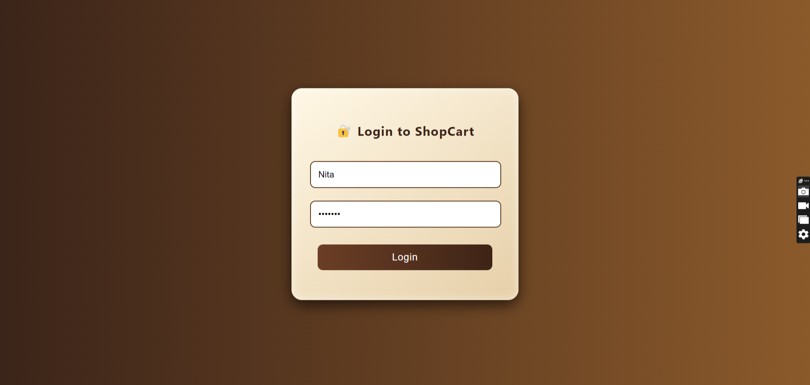
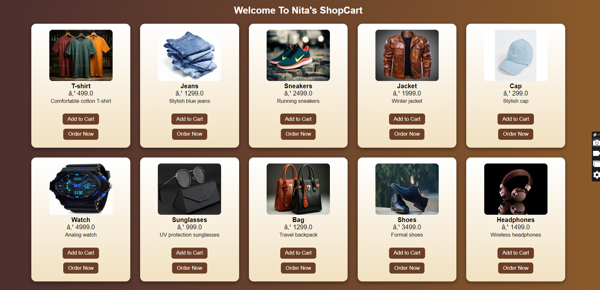

# Shopping Cart Web Application

A full-stack Shopping Cart web application developed as a mini project to demonstrate core concepts of web development using Java technologies.

## 📋 Project Overview
This application allows users to log in, view products, add them to a shopping cart, and place orders.  
It provides a simple and user-friendly interface with backend database connectivity.

## ✨ Key Features
- User authentication (Login system)  
- Product listing with prices  
- Add to Cart functionality  
- Order Now option  
- MySQL database integration  
- Clean and responsive UI  

## 🛠️ Technologies Used
- Frontend: HTML, CSS  
- Backend: JSP, Servlets  
- Database: MySQL  
- Server: Apache Tomcat  

## 📂 Project Structure
- `src/` – Java source files (Servlets, Beans, DAO)  
- `webapp/` – JSP pages  
- `css/` – Stylesheets  
- `database/` – SQL scripts  
- `screenshots/` – Output images  

## ⚙️ Setup and Installation
1. Clone or download the repository  
2. Import the project into Eclipse or any Java IDE  
3. Configure Apache Tomcat server  
4. Create the required database in MySQL  
5. Update database credentials in the configuration file  
6. Run the project on the browser  

## 🎯 Objective
The objective of this project is to understand and implement:
- MVC architecture  
- JSP and Servlet-based server-side programming  
- Database connectivity using JDBC  
- Basic e-commerce workflow  

## 📸 Output Screenshots

### Login Page

### ShopCart Page

---

### 👩‍💻 Developed By  
**Nita Waghchaure**
